# VLA Simulator — 1-Click VLA Simulation on AWS

Run Vision-Language-Action (VLA) robot simulation workloads on AWS GPU instances with a single command. Supports NVIDIA GR00T N1.7, GR00T N1.6 (GR1 humanoid and Unitree G1 whole-body loco-manipulation), π0.5 (openpi), OpenVLA-OFT, LAP-3B, and RLDX-1 (RLWRLD) — plus an OpenArm Lift-Cube target in Isaac Lab for scripted ACT demo collection.

> See [Showcase — VLA Rollouts](#showcase--vla-rollouts) for sample rollouts across the trained policies and the OpenArm scripted collection run, spanning a range of LIBERO / RoboCasa verbs.

## Overview

| Feature | Detail |
|---------|--------|
| **Models** | GR00T N1.7-LIBERO, GR00T N1.6-3B (GR1), GR00T N1.6-G1 (Unitree G1 loco-manip), π0.5 (pi05_libero), OpenVLA-OFT (LIBERO-10), LAP-3B (LIBERO-Spatial), RLDX-1 (RLWRLD, LIBERO) |
| **Simulation** | LIBERO / RoboCasa (robosuite + MuJoCo, headless EGL); Isaac Lab (OpenArm Lift-Cube collection) |
| **Deploy** | AWS CDK + EC2 GPU (g6/g5, us-east-1; OpenArm needs a 4-GPU `.12xl`) |
| **Results** | S3 (MP4 video + summary) + SNS email |
| **Cleanup** | Auto-terminate EC2; run `destroy.py` for stack teardown |

### Supported VLA Combinations

| `--vla` | `--libero-suite` | Model | Sim Environment | Robot | Stack |
|---------|------------------|-------|----------------|-------|-------|
| `gr00t` | — | GR00T N1.7-LIBERO | LIBERO-10 kitchen tasks | Franka Panda (7-DOF) | `GR00T-Demo` |
| `gr00t-gr1` | — | GR00T N1.6-3B | RoboCasa GR1 tabletop tasks | Fourier GR1 humanoid (22-DOF) | `GR00T-GR1-Demo` |
| `gr00t-g1` | — | GR00T N1.6-G1 (community re-finetune) | GR00T-WholeBodyControl loco-manip (GEAR WBC + MuJoCo) | Unitree G1 humanoid (whole-body) | `GR00T-G1-Demo` |
| `pi` | — | π0.5 (pi05_libero) | LIBERO spatial/object | Franka Panda (7-DOF) | `Pi-Demo` |
| `openvla-oft` | `spatial` | OpenVLA-OFT-7B (LIBERO-Spatial fine-tune) | LIBERO-Spatial | Franka Panda (7-DOF) | `OpenVLA-OFT-Spatial-Demo` |
| `openvla-oft` | `object` | OpenVLA-OFT-7B (LIBERO-Object fine-tune) | LIBERO-Object | Franka Panda (7-DOF) | `OpenVLA-OFT-Object-Demo` |
| `openvla-oft` | `goal` | OpenVLA-OFT-7B (LIBERO-Goal fine-tune) | LIBERO-Goal | Franka Panda (7-DOF) | `OpenVLA-OFT-Goal-Demo` |
| `openvla-oft` | `10` (default, alias `long`) | OpenVLA-OFT-7B (LIBERO-10 fine-tune) | LIBERO-10 long-horizon | Franka Panda (7-DOF) | `OpenVLA-OFT-Demo` |
| `lap` | — | LAP-3B (PaliGemma-3B + Flow Matching, JAX) | LIBERO-Spatial | Franka Panda (7-DOF) | `LAP-Demo` |
| `rldx` | — | RLDX-1 (RLWRLD MSAT / Qwen3-VL-8B, eager)¹ | LIBERO-10 long-horizon | Franka Panda (7-DOF) | `RLDX-Demo` |
| `openarm-lift-act` | — | Scripted state machine (ACT data collection) | Isaac Lab Lift-Cube | OpenArm (unimanual, 7-DOF + gripper) | `OpenArm-Lift-ACT-Demo` |

¹ RLDX-1 weights are under the **RLWRLD Model License v1.0 (non-commercial)**; "simulation benchmarking" is an explicit intended use. AWS-internal enablement / benchmarking only — not for customer-facing commercial positioning. Weights are downloaded from Hugging Face at runtime (not vendored).

### Showcase — VLA Rollouts

Sample rollouts captured directly from `deploy.py` runs and synced from each stack's S3 results bucket. GIFs are downsampled previews (288 px, 10 fps, ≤8 s); click-through to the full-quality MP4 in [`docs/showcase/`](docs/showcase/) for the original frame rate and resolution.

#### `pi` — π0.5 on LIBERO (Franka Panda 7-DOF)

`libero_spatial = 0.99` (10 tasks × 10 episodes), `libero_object = 0.96` (10 tasks × 5 episodes) — `g5.xlarge`, validated 2026-04-22.

| LIBERO-Spatial — pick black bowl between plate and ramekin | LIBERO-Object — pick milk and place in basket |
|---|---|
| 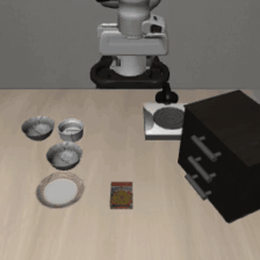 | 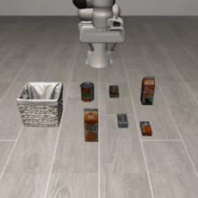 |
| MP4: [`pi/libero-spatial-between-plate-ramekin-success.mp4`](docs/showcase/pi/libero-spatial-between-plate-ramekin-success.mp4) | MP4: [`pi/libero-object-milk-success.mp4`](docs/showcase/pi/libero-object-milk-success.mp4) |

#### `openvla-oft` — OpenVLA-OFT on LIBERO-10 long-horizon

Each task is a two-stage instruction. Long-horizon means the policy must complete one sub-goal, recognise it, then proceed to the next. Verb diversity below shows the same checkpoint following structurally different instructions. `g6.xlarge`, validated 2026-05-04.

| `put both the alphabet soup and the tomato sauce in the basket` | `turn on the stove and put the moka pot on it` |
|---|---|
| 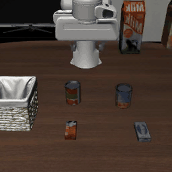 | 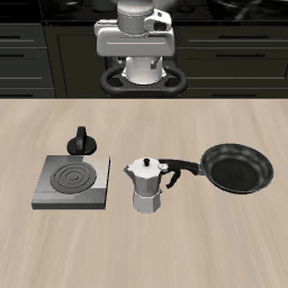 |
| MP4: [`openvla-oft/libero-10-soup-and-sauce-success.mp4`](docs/showcase/openvla-oft/libero-10-soup-and-sauce-success.mp4) | MP4: [`openvla-oft/libero-10-stove-moka-pot-success.mp4`](docs/showcase/openvla-oft/libero-10-stove-moka-pot-success.mp4) |

| `put the white mug on the left plate and the yellow mug on the right` | `pick up the book and place it in the back compartment` |
|---|---|
| 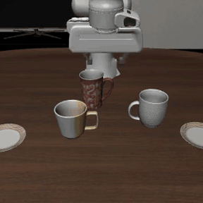 | 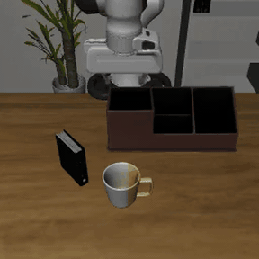 |
| MP4: [`openvla-oft/libero-10-mug-left-yellow-right-success.mp4`](docs/showcase/openvla-oft/libero-10-mug-left-yellow-right-success.mp4) | MP4: [`openvla-oft/libero-10-book-compartment-success.mp4`](docs/showcase/openvla-oft/libero-10-book-compartment-success.mp4) |

#### `lap` — LAP-3B on LIBERO-Spatial

`libero_spatial = 0.98` (10 tasks × 5 trials, `g6.xlarge`, validated 2026-05-17). Same scene as `pi` above, different policy — useful for side-by-side comparison. The `cookie_box` task is the one consistent failure mode (paper Table III range 85–95% leaves 1–2 tasks expected to miss).

| Success — `pick up the black bowl between the plate and the ramekin` | Failure — `pick up the black bowl on the cookie box` |
|---|---|
| 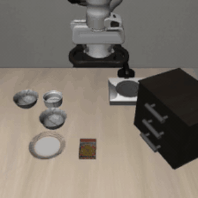 | 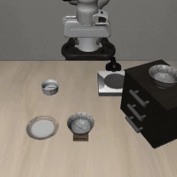 |
| MP4: [`lap/libero-spatial-between-plate-ramekin-success.mp4`](docs/showcase/lap/libero-spatial-between-plate-ramekin-success.mp4) | MP4: [`lap/libero-spatial-cookie-box-failure.mp4`](docs/showcase/lap/libero-spatial-cookie-box-failure.mp4) |

#### `rldx` — RLDX-1 (RLWRLD) on LIBERO-10 long-horizon (Franka Panda 7-DOF)

RLDX-1 is a Korea-origin SOTA open VLA (MSAT action head on a Qwen3-VL-8B backbone; 97.8% LIBERO average in the paper). Served eager via a ZeroMQ policy server + sim client (two venvs), `g6.xlarge` L4 sm_89, validated 2026-06-20. Two LIBERO-10 **long-horizon** tasks (distinct scenes from the `pi` / `lap` spatial clips above): `STUDY_SCENE1` book→caddy `success_rate = 1.0` (5/5); `KITCHEN_SCENE6` mug→microwave+close (articulated, two-stage) `success_rate = 0.8` (4/5). Weights are **non-commercial** (RLWRLD Model License v1.0) — sim benchmarking only.

| Success — `STUDY_SCENE1: pick up the book and place it in the back compartment of the caddy` (SR 1.0, 5/5) | Success — `KITCHEN_SCENE6: put the yellow and white mug in the microwave and close it` (SR 0.8, 4/5) |
|---|---|
| 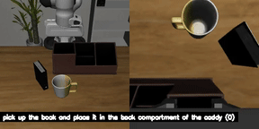 | 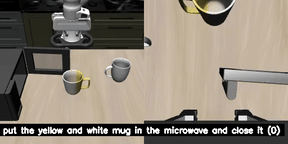 |
| MP4: [`rldx/libero10-study-book-caddy-success.mp4`](docs/showcase/rldx/libero10-study-book-caddy-success.mp4) | MP4: [`rldx/libero10-kitchen-mug-microwave-success.mp4`](docs/showcase/rldx/libero10-kitchen-mug-microwave-success.mp4) |
| _Tight, consistent: all 5 episodes complete in 20–23 env-steps._ | Failure (1/5) — same task, hits the 90-step cap without closing: |
| | 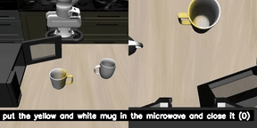 |
| | MP4: [`rldx/libero10-kitchen-mug-microwave-failure.mp4`](docs/showcase/rldx/libero10-kitchen-mug-microwave-failure.mp4) (clip is 2× speed) |

> **Reading the success rate — "success" is a binary goal flag, not a quality score.** LIBERO marks an episode `success` the moment its BDDL goal predicate is satisfied; it says nothing about how cleanly or how close to the failure boundary the policy got there. That distinction matters on long-horizon tasks:
> - `STUDY_SCENE1` (SR 1.0) is genuinely robust — every episode finishes in 20–23 env-steps with margin to spare.
> - `KITCHEN_SCENE6` (SR 0.8) is **marginal even when it succeeds**: successful episodes range from a clean 32 steps to a labored 47 steps, while the failure runs the full 90-step cap (a *timeout*, not a hard error). The scene also contains a second (grey) mug as a distractor next to the yellow/white target. A near-cap success is one perturbation away from a timeout — so treat 0.8 here as "works, but not yet deployment-margin," not as a 4-in-5 guarantee of reliable execution.
>
> Takeaway for demos: pair the SR number with the **step-count spread** (in `simulation_results.csv`) and watch the failure clip — a high SR with episodes clustered near the step cap is a weaker result than the same SR with short, consistent runs.

#### `gr00t-gr1` — GR00T N1.6 on RoboCasa GR1 humanoid (22-DOF)

The GR1 humanoid is a different embodiment from Franka Panda — two arms, waist, Fourier dexterous hands. `PosttrainPnPNovelFromPlateToBowlSplitA` is in distribution for the post-trained N1.6 (~80% success), while `PnPCanToDrawerClose` is **not supported** by the pre-trained checkpoint and consistently fails — included to make the embodiment-coverage limitation visible. `g6.12xlarge`, validated 2026-04-10.

| Success — `PosttrainPnPNovelFromPlateToBowlSplitA` (in-distribution) | Failure — `PnPCanToDrawerClose` (not supported by N1.6) |
|---|---|
| 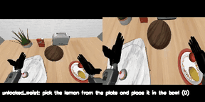 | 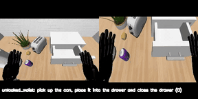 |
| MP4: [`gr00t-gr1/posttrain-pnp-plate-to-bowl-success.mp4`](docs/showcase/gr00t-gr1/posttrain-pnp-plate-to-bowl-success.mp4) | MP4: [`gr00t-gr1/pnp-can-to-drawer-failure.mp4`](docs/showcase/gr00t-gr1/pnp-can-to-drawer-failure.mp4) |

#### `gr00t-g1` — GR00T N1.6 on Unitree G1 (whole-body loco-manipulation)

This is **whole-body loco-manipulation**, not tabletop: the dual-view clips show the G1 humanoid grasp the apple, then *walk left* on its own legs (GR00T-WholeBodyControl Balance/Walk ONNX policies) to a second table and place it on the plate — task `pick up the apple, walk left and place the apple on the plate` (`LMPnPAppleToPlateDC_G1_gear_wbc`). The left pane is the ego/close view, the right is third-person.

> **Checkpoint note.** NVIDIA published no N1.7 Unitree G1 checkpoint, and the only public N1.6 G1 checkpoint (`nvidia/GR00T-N1.6-G1-PnPAppleToPlate`) does **not** reproduce its stated success rate under the released evaluation command — it scores 0/10, matching multiple open Isaac-GR00T issues with no upstream fix. The only public artifact that reproduces the task is a community re-finetune, [`cloudwalk-research/GR00T-N1.6-G1-PnPAppleToPlate`](https://huggingface.co/cloudwalk-research/GR00T-N1.6-G1-PnPAppleToPlate) (same GR00T N1.6 architecture, drop-in compatible), which scores **`success_rate = 0.3` (3/10)** here. `g6.12xlarge`, `n_envs=1`, validated 2026-06-15.

| Success — apple picked, walked left, placed on plate | Failure — grasp + walk OK, placement misses |
|---|---|
| 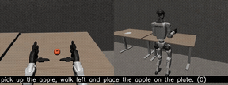 | 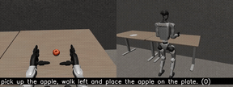 |
| MP4: [`gr00t-g1/loco-manip-apple-to-plate-success.mp4`](docs/showcase/gr00t-g1/loco-manip-apple-to-plate-success.mp4) | MP4: [`gr00t-g1/loco-manip-apple-to-plate-failure.mp4`](docs/showcase/gr00t-g1/loco-manip-apple-to-plate-failure.mp4) |

#### `gr00t` — GR00T N1.7 on LIBERO-10 (Franka Panda)

*Video capture pending — KITCHEN_SCENE3/4 success rate is `1.0` on the validated runs (see [Expected Results](#expected-results)), but those rollout videos were not retained locally. Will backfill on the next `--vla gr00t` deploy.*

#### `openarm-lift-act` — OpenArm unimanual Lift-Cube (Isaac Lab)

> **Not a learned-policy rollout.** Unlike the entries above (each a trained VLA evaluated in LIBERO/RoboCasa), this target runs a **scripted state machine** (`REST → APPROACH → GRASP → LIFT`) on the OpenArm arm in Isaac Lab to *collect* successful pick-and-lift demonstrations — the camera + state + action HDF5 that an ACT policy is then trained on. The clip shows the data-collection rollout, not an evaluated policy. Training ACT on this dataset and showing a *learned* rollout is the next step.

Rendered at 768×768, captured during a `--vla openarm-lift-act` collection run (`g6.12xlarge`, 4× L4, eu-central-1, 2026-06-11). The third-person (table) view is the beauty shot; the wrist view is the gripper POV.

| Third-person (table camera) — pick + lift cube | Wrist camera (gripper POV) |
|---|---|
| 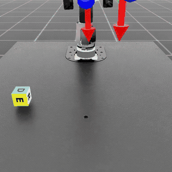 |  |
| MP4: [`openarm-lift-act/lift-cube-table-success.mp4`](docs/showcase/openarm-lift-act/lift-cube-table-success.mp4) | MP4: [`openarm-lift-act/lift-cube-wrist-success.mp4`](docs/showcase/openarm-lift-act/lift-cube-wrist-success.mp4) |

---

### Architecture

```
deploy.py
  │
  ├─ generate.py          → assets/userdata/{vla}.sh
  │
  └─ CDK deploy
       ├─ VPC + SG
       ├─ S3 ResultsBucket (RETAIN)
       ├─ SNS + EmailSubscription
       ├─ IAM Role
       ├─ AzSelector Lambda  →  EC2 (g6.12xlarge / g5.xlarge)
       └─ WaitCondition      ←  cfn_signal from UserData
```

**Two deployment modes:**

- **Local mode** — model runs directly on the EC2 instance (default)
- **Bridge mode** — EC2 runs simulation env; model inference forwarded to an existing VLA Hub ECS endpoint

---

## Quick Start

A single CLI (`vlasim.py`) wraps the whole setup into three commands. It runs on
the standard library alone, so `doctor` works on a fresh host **before** any
dependencies are installed.

```bash
# 1. See what's missing (read-only — safe to run anytime)
python vlasim.py doctor

# 2. One-time setup: installs Python + CDK deps and fills simulator-config.yaml
python vlasim.py init --email you@example.com
#   add --bootstrap to also run `cdk bootstrap` for your account/region

# 3. Deploy (runs doctor as a preflight first, then deploy.py)
python vlasim.py deploy --vla gr00t-g1
```

`doctor` checks: Python/Node/CDK versions and installs, AWS credentials, region
support, CDK bootstrap, GPU On-Demand vCPU quota (per target), and `notify_email`.
It exits non-zero if any check **FAILs**, so the `deploy` preflight stops a missing
quota or un-bootstrapped account in seconds rather than mid-deploy (idle GPU billing).

```
$ python vlasim.py doctor --vla gr00t-g1
  [ OK ] Python 3.12.1 (>= 3.10)
  [ OK ] Node v22.22.1
  [ OK ] AWS credentials valid (account ..., region us-east-1)
  [ OK ] CDK bootstrap present in us-east-1
  [ OK ] On-Demand G/VR vCPU quota = 768 in us-east-1 (>= 4 for g6.xlarge ...)
  [FAIL] notify_email is still the placeholder
         -> run: python vlasim.py init --email YOU@EXAMPLE.COM
```

`deploy` and `destroy` forward every flag to `deploy.py` / `destroy.py` unchanged
(`--bridge`, `--collect`, `--libero-suite`, `--region`, …). Use `--skip-doctor` to
bypass the deploy preflight. Run `python vlasim.py deploy --help` for the full list.

Supported regions: `us-east-1`, `us-west-2`, `ap-northeast-1`, `ap-northeast-2`, `eu-central-1`

> **Manual setup** (equivalent to `init`, if you prefer to run the steps yourself):
> ```bash
> pip install -r requirements.txt          # boto3, pyyaml, jinja2
> cd cdk && npm install && cd ..           # CDK deps (aws-cdk is pinned in cdk/package.json)
> aws configure                            # or: export AWS_PROFILE=...
> # then edit deployment.region / notify_email in simulator-config.yaml
> ```

---

## Deploy Targets

`vlasim deploy` / `vlasim destroy` forward to `deploy.py` / `destroy.py`. The full
per-target invocations (all also runnable directly as `python deploy.py ...`):

```bash
# GR00T N1.7 — LIBERO kitchen tasks (~120 min)
python deploy.py --vla gr00t --email you@example.com

# GR00T N1.6 + GR1 humanoid — RoboCasa tabletop tasks (~90 min)
python deploy.py --vla gr00t-gr1 --email you@example.com

# GR00T N1.6 + Unitree G1 — whole-body loco-manipulation (GR00T-WholeBodyControl, ~20-30 min)
python deploy.py --vla gr00t-g1 --email you@example.com

# π0.5 — LIBERO spatial + object tasks (~4 hrs)
python deploy.py --vla pi --email you@example.com

# OpenVLA-OFT — LIBERO-10 long-horizon (~3 hrs, local mode only; default suite)
python deploy.py --vla openvla-oft --email you@example.com

# OpenVLA-OFT — LIBERO-Spatial short-horizon (~1.5 hrs)
python deploy.py --vla openvla-oft --libero-suite spatial --email you@example.com

# Other short-horizon suites: object, goal
python deploy.py --vla openvla-oft --libero-suite object --email you@example.com
python deploy.py --vla openvla-oft --libero-suite goal   --email you@example.com

# LAP-3B — LIBERO-Spatial (zero-shot cross-embodiment VLA, JAX policy server, ~1.5-2.5 hrs)
python deploy.py --vla lap --email you@example.com

# RLDX-1 (RLWRLD) — LIBERO (SOTA open VLA, MSAT/Qwen3-VL-8B, ZeroMQ server + sim client, ~80-120 min)
# NON-COMMERCIAL weights (sim benchmarking) — AWS-internal enablement only.
python deploy.py --vla rldx --email you@example.com

# OpenArm Lift-Cube — scripted ACT demo collection in Isaac Lab (HDF5 only; needs a 4-GPU instance)
python deploy.py --vla openarm-lift-act --email you@example.com
```

On first deploy you will receive an SNS subscription confirmation email — **click the link** to enable notifications.

---

## Monitor (optional)

```bash
# GR00T N1.7 logs
aws logs tail /gr00t/userdata --follow --region us-east-1

# GR00T N1.6 + GR1 logs
aws logs tail /gr00t-gr1/userdata --follow --region us-east-1

# GR00T N1.6 + Unitree G1 logs
aws logs tail /gr00t-g1/userdata --follow --region us-east-1

# π0.5 logs
aws logs tail /pi/userdata --follow --region us-east-1

# OpenVLA-OFT logs
aws logs tail /openvla-oft/userdata --follow --region us-east-1

# LAP-3B logs
aws logs tail /lap/userdata --follow --region us-east-1

# RLDX-1 logs
aws logs tail /rldx/userdata --follow --region us-east-1
```

---

## Results

When simulation finishes you receive an SNS email with download instructions:

```bash
# GR00T results
aws s3 sync s3://vla-sim-results-gr00t-demo-us-east-1-<ACCOUNT>/RUN_ID/ ./results/ --region us-east-1

# π0.5 results
aws s3 sync s3://vla-sim-results-pi-demo-us-east-1-<ACCOUNT>/RUN_ID/ ./results/ --region us-east-1
```

Each `task-N/` folder contains:
- `videos/rollout_<task_name>_success.mp4` — successful episodes
- `videos/rollout_<task_name>_failure.mp4` — failed episodes
- `videos/<name>.txt` — per-video metadata
- `summary.txt` — `success_rate`, `suite`, `num_episodes_per_task`
- `compose.log` / `userdata.log` — execution logs

---

## Cleanup

```bash
python vlasim.py destroy --vla gr00t-g1   # or, equivalently:
python destroy.py --vla gr00t
python destroy.py --vla gr00t-gr1
python destroy.py --vla gr00t-g1
python destroy.py --vla pi
python destroy.py --vla openvla-oft                         # default suite (10)
python destroy.py --vla openvla-oft --libero-suite spatial  # non-default suite
python destroy.py --vla lap
python destroy.py --vla rldx
```

The S3 results bucket is **retained** after stack deletion to preserve simulation outputs.

---

## Expected Results

| `--vla` | Task | Expected Success Rate | Source |
|---------|------|-----------------------|--------|
| `gr00t` | KITCHEN_SCENE3 (stove + moka pot) | ~90–100% | validated 2026-04-27 |
| `gr00t` | KITCHEN_SCENE4 (black bowl in drawer) | ~90–100% | validated 2026-04-27 |
| `gr00t-gr1` | PosttrainPnPNovelFromPlateToBowlSplitA (GR1) | ~80% | validated 2026-04-12 |
| `gr00t-gr1` | PnPCanToDrawerClose (GR1) | 0% (pre-trained N1.6 not supported) | validated 2026-04-12 |
| `gr00t-g1` | LMPnPAppleToPlateDC (G1 loco-manip, community re-finetune) | 30% (3/10) | validated 2026-06-15 — `nvidia/...` checkpoint scores 0%; `cloudwalk-research` re-finetune used |
| `pi` | libero_object | ~80–94% | validated 2026-04-27 |
| `pi` | libero_spatial | ~85–95% | validated 2026-04-27 |
| `openvla-oft --libero-suite spatial` | libero_spatial | 97.6% (paper Table I) | validated 2026-06-01 — 0.92 (46/50, 5 trials/task × 10 tasks, g6.xlarge); within paper ±5%p band at n=50 |
| `openvla-oft --libero-suite object` | libero_object | 98.4% (paper Table I) | pending smoke test |
| `openvla-oft --libero-suite goal` | libero_goal | 97.9% (paper Table I) | pending smoke test |
| `openvla-oft --libero-suite 10` | libero_10 (long-horizon) | 94.5% (paper Table I) | validated 2026-05-04 |
| `lap` | libero_spatial | ~85-95% (paper Table III, LIBERO fine-tuned) | validated 2026-05-17 — 0.98 @ 5 trials/task |
| `rldx` | libero_spatial (single task) | 97.8% LIBERO avg (paper, SOTA) | validated 2026-06-20 — 1.0 (5/5 ep, eager, g6.xlarge L4 sm_89, full `deploy.py` smoke) |

**Validated results (us-east-1, g6.12xlarge / g5.xlarge / g6.xlarge):**
- GR00T N1.7: KITCHEN_SCENE3 = 1.0 (5/5), KITCHEN_SCENE4 = 1.0 (3/3)
- GR00T N1.6 + GR1: PosttrainPnP = 0.8 (4/5), PnPCanToDrawer = 0.0 (pre-trained model limitation)
- GR00T N1.6 + Unitree G1 (whole-body loco-manip): LMPnPAppleToPlateDC = 0.3 (3/10, `n_envs=1`, g6.12xlarge, us-west-2) — `cloudwalk-research` community re-finetune; the `nvidia/GR00T-N1.6-G1-PnPAppleToPlate` checkpoint scores 0/10 under the same command (matches open Isaac-GR00T issues, no upstream fix)
- π0.5: libero_object = 0.94 (47/50)
- OpenVLA-OFT: libero_10 = 1.0 (10/10 at 1 trial/task, g6.xlarge)
- OpenVLA-OFT: libero_spatial = 0.92 (46/50, 5 trials/task × 10 tasks, g6.xlarge) — paper Table I = 97.6%; the gap (5.6%p) is within sampling noise at n=50 (SE ≈ 3.8%p). 8/10 tasks at 5/5; misses concentrated on `on_the_ramekin` (2/5) and `next_to_the_plate` (4/5)
- LAP-3B: libero_spatial = 0.98 (49/50, 5 trials/task × 10 tasks, g6.xlarge) — exceeds paper Table III range (85–95%); requires upstream `scripts/libero/main.py` vertical-flip patch (see `templates/lap-userdata.sh.j2`)
- RLDX-1 (RLWRLD): libero_10 long-horizon, two tasks (eager, g6.xlarge L4 sm_89) — `STUDY_SCENE1` book→caddy = 1.0 (5/5, tight 20–23 steps), `KITCHEN_SCENE6` mug→microwave+close = 0.8 (4/5; successes span 32–47 steps and the one failure is a 90-step-cap timeout — marginal even when it succeeds, see the showcase caveat). Full `deploy.py` deploy; ZeroMQ policy server + sim client, two-venv (main + `libero_uv`). Default `n_envs=1` (5 recommended on g6.2xlarge+); checkpoint `RLWRLD/RLDX-1-FT-LIBERO@989037c6`, repo `RLWRLD/RLDX-1@ecbfaf80`

---

## Configuration Reference

### `simulator-config.yaml` (shared)

| Key | Default | Description |
|-----|---------|-------------|
| `deployment.region` | `us-east-1` | AWS region |
| `deployment.notify_email` | *(required)* | SNS notification email |
| `deployment.s3_results_prefix` | `vla-sim-results` | S3 bucket name prefix |
| `deployment.auto_terminate` | `true` | Auto-terminate EC2 after completion |

### `models/gr00t.yaml`

| Key | Description |
|-----|-------------|
| `model.hf_repo` | HuggingFace repo for checkpoint download |
| `model.hf_subfolder` | Subfolder within repo (e.g. `libero_10`) |
| `model.hf_model_revision` | Pinned commit SHA for reproducibility |
| `model.isaac_groot_commit` | Pinned Isaac-GR00T commit SHA |
| `instance.preferred` | GPU instance type fallback list |
| `instance.ebs_gb` | Root EBS volume size (GB) |
| `tasks` | List of LIBERO tasks to evaluate |

### `models/pi.yaml`

| Key | Description |
|-----|-------------|
| `model.openpi_commit` | Pinned openpi commit SHA |
| `instance.preferred` | GPU instance type fallback list |
| `tasks[].suite` | LIBERO suite name (`libero_spatial`, `libero_object`, etc.) |
| `tasks[].num_episodes` | Episodes per task |

---

## Project Structure

```
vla-simulator/
├── vlasim.py                 # CLI front end: doctor / init / deploy / destroy
├── simulator-config.yaml     # Shared deployment settings
├── docs/
│   └── showcase/             # Sample rollout MP4 + GIF preview per VLA policy
├── models/
│   ├── gr00t.yaml            # GR00T N1.7 config
│   ├── gr00t-gr1.yaml        # GR00T N1.6 + GR1 humanoid config
│   ├── gr00t-g1.yaml         # GR00T N1.6 + Unitree G1 whole-body loco-manip config
│   ├── pi.yaml               # π0.5 config
│   ├── openvla-oft.yaml      # OpenVLA-OFT config (per-suite checkpoints)
│   └── lap.yaml              # LAP-3B config
├── deploy.py                 # 1-click deploy entrypoint
├── destroy.py                # Stack teardown
├── generate.py               # Generates assets/userdata/{vla}.sh from templates
├── requirements.txt
├── cdk/
│   ├── bin/app.ts
│   └── lib/
│       ├── vla-simulator-stack.ts   # Unified CDK stack
│       └── az-selector.ts           # GPU capacity Lambda (AZ/type fallback)
├── assets/
│   ├── userdata/             # Generated scripts (gitignored)
│   └── bridge/
│       ├── gr00t/            # ZMQ-gRPC bridge for GR00T
│       ├── pi/               # gRPC bridge for π0.5
│       └── lap/              # WebSocket↔gRPC bridge for LAP-3B (port 50055)
└── templates/
    ├── gr00t-userdata.sh.j2        # Jinja2 template for GR00T UserData
    ├── gr00t-gr1-userdata.sh.j2    # GR00T N1.6 + GR1 humanoid
    ├── gr00t-g1-userdata.sh.j2     # GR00T N1.6 + Unitree G1 (GR00T-WholeBodyControl loco-manip)
    ├── pi-userdata.sh.j2           # π0.5 (Docker Compose)
    ├── openvla-oft-userdata.sh.j2  # OpenVLA-OFT (single conda env)
    ├── lap-userdata.sh.j2          # LAP-3B (uv 2-venv: JAX policy + LIBERO sim)
    ├── openarm-isaac-userdata.sh.j2     # OpenArm bimanual π0.5 eval (Isaac Lab container)
    └── openarm-lift-act-userdata.sh.j2  # OpenArm Lift-Cube scripted ACT collection (Isaac Lab)
```

---

## Bridge Mode

Bridge mode connects the simulation environment on EC2 to an external VLA model endpoint (e.g. VLA Hub on ECS), without downloading the model locally.

### GR00T bridge

```bash
# Set endpoint in models/gr00t.yaml (or SSM):
#   bridge.remote_grpc_endpoint: ssm:/vla-hub/gr00t/n1-7/grpc-endpoint
#   bridge.vpc_id: ssm:/vla-hub/vpc-id

python deploy.py --vla gr00t --bridge
```

### π0.5 bridge

```bash
# Set in models/pi.yaml:
#   bridge.vpc_id: vpc-xxxxxxxxxxxxxxxxx
#   bridge.nlb_endpoint: internal-xxx.elb.us-east-1.amazonaws.com:50052

python deploy.py --vla pi --bridge
```

### LAP-3B bridge

LAP shares π0.5's openpi WebSocket bridge pattern. The instance runs only the LIBERO
sim + a WebSocket↔gRPC bridge (`assets/bridge/lap/`); the LAP-3B JAX model runs on the
remote vla-hub LAP ECS task (port 50055). No local checkpoint download.

```bash
# Set in models/lap.yaml (or use ssm: for nlb_endpoint):
#   bridge.vpc_id: vpc-xxxxxxxxxxxxxxxxx                       # the vla-hub VPC
#   bridge.nlb_endpoint: internal-xxx.elb.us-west-2.amazonaws.com:50055
#                        or ssm:/vla-hub/lap/3b/grpc-endpoint

python deploy.py --vla lap --bridge
```

> Bridge differs from π0.5 only in the wire contract: LAP uses a nested observation
> (`observation.base_0_rgb` / `left_wrist_0_rgb` / `state`), a 10-dim state
> (eef_pos 3 + eef_rot6d 6 + gripper 1), a `frame_description` field, and a (10,7)
> action chunk — see `assets/bridge/lap/lap.proto`.

---

## Troubleshooting

### "Embodiment tag 'LIBERO_PANDA' is not supported"

The **base** GR00T N1.7-3B model does not support LIBERO simulation. Use the fine-tuned checkpoint:

```yaml
# models/gr00t.yaml
model:
  hf_repo: nvidia/GR00T-N1.7-LIBERO
  hf_subfolder: libero_10
```

### "No visible GPU devices" (π0.5 task-0)

JAX inside the Docker container fails if GPU passthrough isn't ready before the task loop starts. The `[2.5/5]` step in the UserData script polls `docker run --gpus all nvidia-smi` until GPU is confirmed before proceeding.

### Stack rollback / InsufficientInstanceCapacity

The `AzSelectorConstruct` Lambda automatically retries across AZs and falls back through the instance type preference list (`g6.12xlarge` → `g5.12xlarge` → `g6.xlarge` → `g5.xlarge` for GR00T). No manual intervention needed — CDK rollback means no capacity was found; re-deploying will retry.

### CDK synth cdk.out conflict (parallel deploys)

Use model-specific output directories:

```bash
npx cdk deploy GR00T-Demo --output cdk.out-gr00t -c vla=gr00t -c region=us-east-1 ...
npx cdk deploy Pi-Demo    --output cdk.out-pi    -c vla=pi    -c region=us-east-1 ...
```

`deploy.py` handles this automatically.

### apt lock on DLAMI boot

`unattended-upgrades` holds the apt lock for ~2 minutes on fresh boot. The UserData waits up to 120 seconds then forcibly kills the process. No action needed.

---

## Cost Estimate (us-east-1, on-demand)

| Instance | Spot/OD | Hourly | GR00T (~2h) | π0.5 (~4h) | LAP (~2.5h) |
|----------|---------|--------|-------------|------------|-------------|
| g6.12xlarge | On-Demand | ~$4.09 | ~$8.18 | — | — |
| g5.xlarge   | On-Demand | ~$1.01 | — | ~$4.04 | — |
| g6.xlarge   | On-Demand | ~$0.80 | — | — | ~$2.00 |

Use Spot instances via `deploy.py --spot` (not yet implemented) for 60–70% savings.

---

## Related Projects

- [Isaac-GR00T](https://github.com/NVIDIA/Isaac-GR00T) — NVIDIA GR00T foundation model
- [openpi](https://github.com/Physical-Intelligence/openpi) — Physical Intelligence π0.5
- [openvla-oft](https://github.com/moojink/openvla-oft) — OpenVLA-OFT (Optimized Fine-Tuning)
- [lap](https://github.com/lihzha/lap) — LAP: Language-Action Pre-Training (zero-shot cross-embodiment, JAX)
- [LIBERO](https://libero-project.github.io/) — Long-horizon robot benchmark
